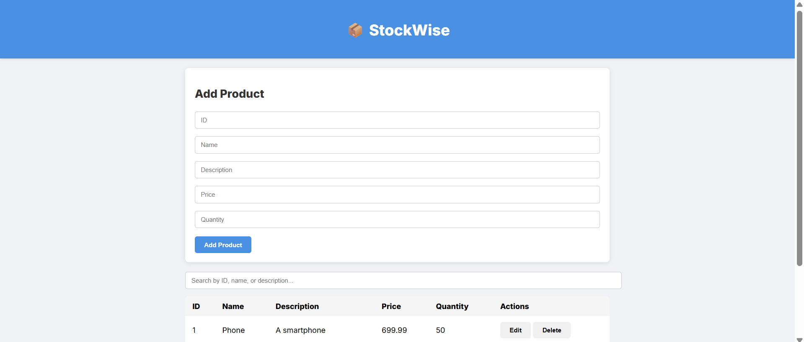

# StockWise - Inventory Management System

  
*Above is a screenshot of the frontend interface of StockWise.*

---

## Table of Contents

1. [Project Overview](#project-overview)  
2. [Features](#features)  
3. [Technologies Used](#technologies-used)  
4. [Folder Structure](#folder-structure)  
5. [Backend Setup](#backend-setup)  
6. [Frontend Setup](#frontend-setup)  
7. [API Endpoints](#api-endpoints)  
8. [Usage Instructions](#usage-instructions)  
9. [Screenshots](#screenshots)  
10. [Future Improvements](#future-improvements)  
11. [License](#license)  

---

## Project Overview

**StockWise** is a simple inventory management system that allows users to manage products with basic CRUD operations.  
It is built using **FastAPI** for the backend, **PostgreSQL** as the database, and a **vanilla JavaScript frontend** for interacting with the API.  

The system is designed to be lightweight, fast, and easy to extend. Users can add, update, delete, and search for products with an interactive frontend interface.

---

## Features

- **Product CRUD Operations:** Create, Read, Update, Delete products.  
- **Search Functionality:** Search by product ID, name, or description.  
- **Responsive Frontend:** Simple and clean UI using HTML, CSS, and JavaScript.  
- **Backend Validation:** Data integrity ensured with Pydantic models.  
- **Database Persistence:** Products stored in PostgreSQL for reliability.  
- **CORS Support:** Frontend can access API without restrictions.

---

## Technologies Used

- **Backend:**  
  - FastAPI  
  - SQLAlchemy  
  - PostgreSQL  
  - Pydantic  

- **Frontend:**  
  - HTML5  
  - CSS3  
  - JavaScript (Vanilla JS)  

- **Other Tools:**  
  - `uvicorn` (for running FastAPI)  
  - `Postman` or browser for testing APIs  

---

## Folder Structure

